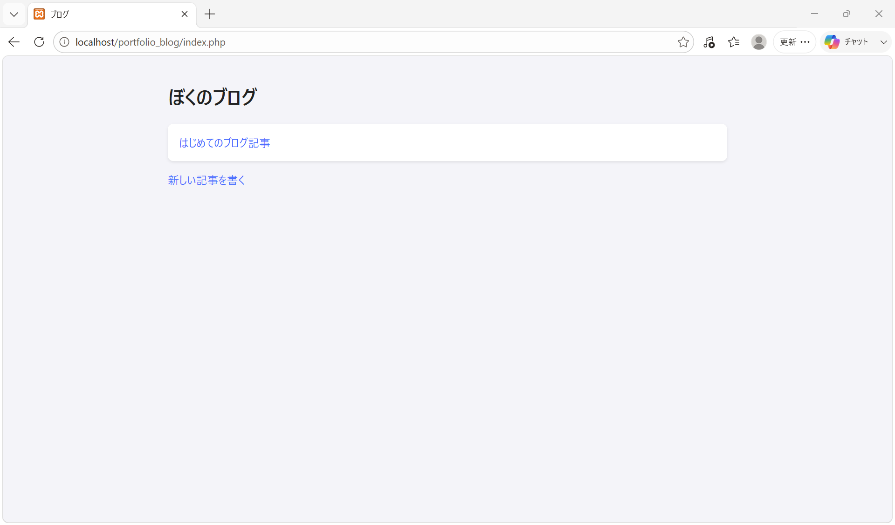
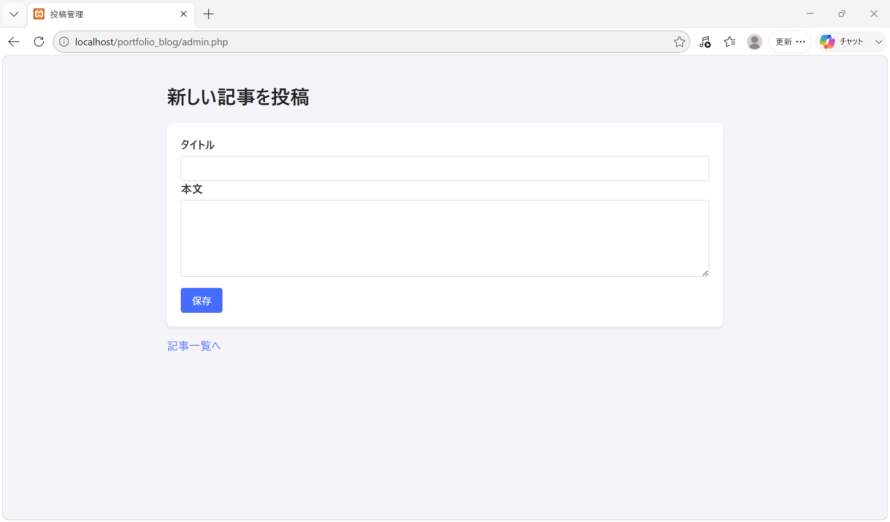
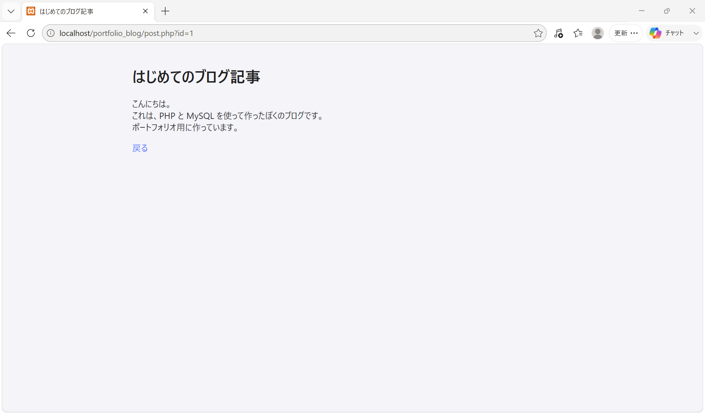

# portfolio_blog

PHP と MySQL で作ったシンプルなブログです。  
記事の投稿、一覧表示、詳細表示ができます。

## 使用技術
- PHP
- MySQL
- HTML
- CSS
- XAMPP

## 主な機能
- 記事の投稿
- 記事一覧表示
- 記事詳細表示

## 起動方法
1. XAMPPでApacheとMySQLを起動します。
2. `htdocs` にプロジェクトを置きます。
3. ブラウザで `http://localhost/portfolio_blog/index.php` を開きます。

## フォルダ構成

portfolio_blog/  
├─ index.php        — 記事一覧ページ  
├─ post.php         — 記事詳細ページ（?id=...）  
├─ admin.php        — 新規記事投稿フォーム  
├─ db.php           — データベース接続（PDO）  
└─ style.css        — 画面のデザイン用CSS
## 画面イメージ

### 記事一覧画面（index.php）

### 新規投稿画面（admin.php）

### 記事詳細画面（post.php）

## データベース構成

データベース名：`portfolio_blog`  
テーブル名：`posts`

カラム例：

- id INT AUTO_INCREMENT PRIMARY KEY  
- title VARCHAR(255) NOT NULL  
- content TEXT NOT NULL

このテーブルに、投稿フォームから送信された記事データを保存しています。

## 実装のポイント（工夫した点）

- PDO を使用して MySQL に接続し、プリペアドステートメントで SQL を実行しています。  
- 画面表示時には `htmlspecialchars()` を使用し、XSS 対策を意識しています。  
- タイトル・本文が空の場合はエラーメッセージを表示するなど、簡単なバリデーションを入れています。  
- 初学者でもコードを追いやすいように、機能ごとにファイルを分けてシンプルな構成にしました。

## 学んだこと・今後の改善予定

学んだこと：
- フォーム入力から PHP 経由でデータベースに保存し、画面に表示する一連の流れを理解しました。  
- セキュリティの基本として、SQLインジェクション対策やXSS対策の重要性を学びました。

今後の改善予定：
- 記事の編集・削除機能の追加  
- 投稿日時（created_at）の保存と表示  
- ログイン機能を導入し、管理者だけが投稿できる仕組みにする  
- ページネーションやカテゴリ機能の追加
